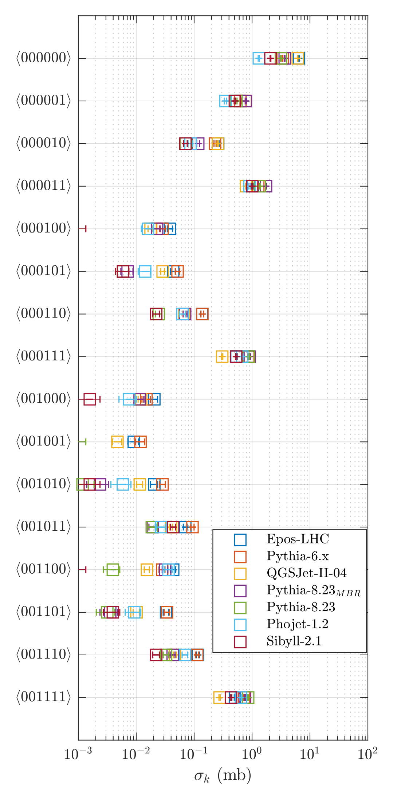

# Diffractive-Combinatorics
https://arxiv.org/abs/1910.06279

[](https://opensource.org/licenses/MIT)

## High Energy Diffraction at the LHC via Combinatorial (incidence) Algebra



### Framework with novel constructions and algorithms:

- Unfolded multidimensional 'fiducial vector cross sections'
- Multivariate Maximum Likelihood fit extraction of the effective Pomeron intercept 1 + &Delta;
- Multivariate Maximum Likelihood fit extraction of the diffractive cross sections (SD, DD, ND) and the maximum diffractive mass dependence (minimum average rapidity gap size <&Delta;Y>)
- Möbius inversion of pileup
- Multidimensional algebraic hierarchy of detector level distributions (raw multiplicity etc.) - highly constraining comparison with MC models, probing AGK rules / multipomeron cuts / soft multiparton interactions

For reference, you may cite the paper above.

mikael.mieskolainen@cern.ch, 2019


## External dependencies:

- <a href="https://alice-doc.github.io/alice-analysis-tutorial/building/">ALICE experiment software</a> (FYI: algorithms here are fully experiment generic)
- <a href="https://gitlab.cern.ch/RooUnfold/RooUnfold">RooUnfold</a> (in /libs, no license)
- <a href="https://github.com/ben-strasser/fast-cpp-csv-parser">csv parser</a> (in /libs, BSD-3 license)

In general, one needs to modify Makefile a bit for your local installation. See Makefile for instructions.

## Install

### 1. AliPhysics/AliROOT installation (ROOT5 based setup is tested to work)

Tested on Ubuntu 18

```bash
cd ~
mkdir alice && cd alice
aliBuild init AliPhysics && aliBuild build AliPhysics --defaults user -z aliroot5
```


### 2. Compile

Tested on Ubuntu 18

```bash
source setenv.sh
cd ./libs/RooUnfold && make && cd ../..
make superclean
make dictionary
make -j4
```
